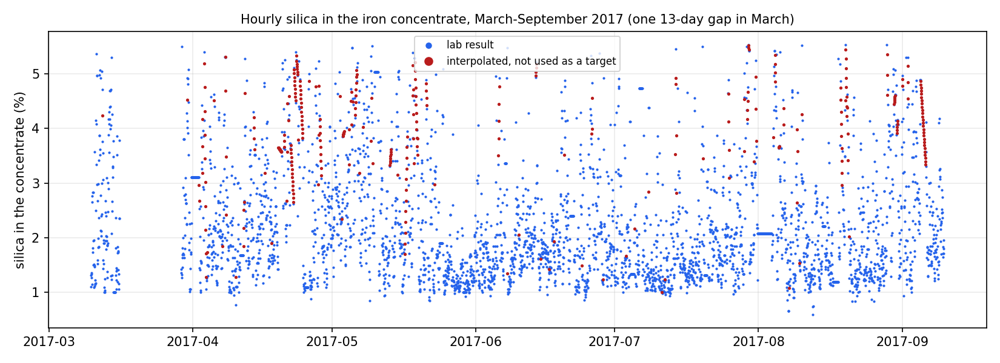
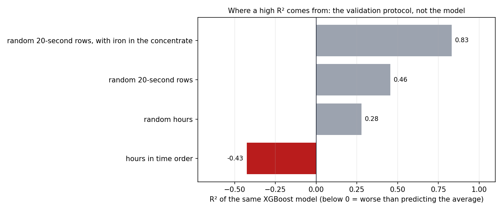
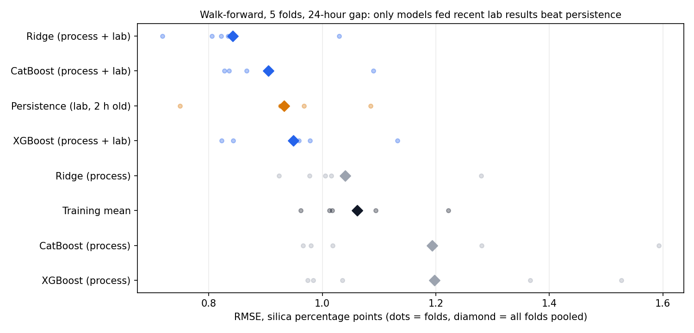
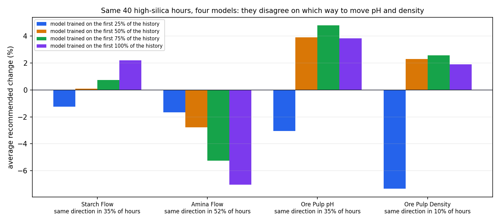
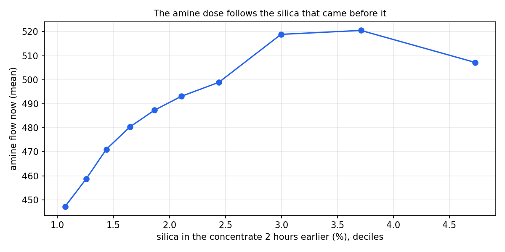

**[English](README.md) | [Español](README.es.md)**

# Flotation Plant Optimization: What the Data Supports

[](https://github.com/Rxyxs/optimizacion-geometalurgica-flotacion-cobre/actions/workflows/ci.yml)  -2ea44f) 

On six months of real data from an iron-ore flotation plant, the same gradient-boosting model that scores R² 0.83 on randomly shuffled 20-second rows is worse than predicting the average once it is validated in time order; only a model fed the latest lab results beats simply repeating the last one, and four models trained on different months recommend opposite pH and pulp-density moves for the same hours, so the data does not support prescribing setpoints.

## What I found

| Finding | Evidence |
|---|---|
| **A high R² here comes from the validation, not the model** | The same XGBoost scores R² 0.83 on random 20-second rows with the iron in the concentrate as an input (it comes from the same lab sample as the silica), 0.46 without it, 0.28 on random hours, and -0.43 on hours in time order: worse than predicting the average. |
| **A pure soft sensor does not work on this plant** | With process variables only, Ridge improves on the training average by 4% of the squared error (Diebold-Mariano p = 0.30, no detectable gain) and XGBoost and CatBoost are 26-27% worse than it. |
| **Recent lab results are what carries the signal** | Adding the last lab result known two hours earlier, Ridge reaches RMSE 0.842 points of silica against 0.932 for persistence (repeating that last result), 10% lower (p < 0.001), and 37% below the error of the average. The tree models gain less and XGBoost does not beat persistence. |
| **Four models, four answers** | For the 40 hours with the most silica in the last five weeks, each of four models trained on different stretches of history promises to cut silica by 0.28 to 0.43 points by moving the four controls at most 10%; they agree on the direction of the move in only 10% (pulp density) to 52% (amine) of the hours, and for pH the oldest model says down while the other three say up. |
| **Two optimizers agreeing proves nothing** | A genetic algorithm and differential evolution find the same optimum on the same model (median difference 0.00 points). The first version of this project used that agreement as validation; it only shows that the optimizers work, not that the model is right. |
| **The likely reason: operators react to the silica** | The amine dose correlates more with the silica measured two hours *earlier* (0.23) than with the silica of the same hour (0.15). A model then reads a high dose as a sign of high silica and recommends less amine, the opposite of what amine does in reverse flotation, where it is the collector that floats the silica. |

## The data

[Quality Prediction in a Mining Process](https://www.kaggle.com/datasets/edumagalhaes/quality-prediction-in-a-mining-process) (Kaggle, `edumagalhaes`, license CC0-1.0, downloaded on 2026-10-08): 737,453 rows from a reverse cationic flotation plant for **iron ore**, 10 March to 9 September 2017. Process variables (starch and amine flow, pulp flow, pH and density, air flow and level of seven columns) are sampled every 20 seconds; the iron and silica of the feed and of the concentrate come from the lab. The goal is the silica in the concentrate, the impurity the plant wants low.

This is not copper and not Chile: public flotation data from a Chilean copper plant does not exist, and this is the most complete real flotation dataset that is open. The questions (what can be predicted from the plant's own sensors, and whether a model can choose reagent doses) are the same for a copper plant.

What the file needed before any model, all handled in `src/data.py` and tested:

- **Timestamps only carry the hour.** The 180 readings of each hour share one timestamp, so the unit of analysis is the hour: 4,097 hours, with means and standard deviations of the 20-second readings.
- **Part of the silica is interpolated.** In 310 hours it changes inside the hour and 232 hours lie on perfectly straight lines between two values; together, 328 hours are not lab results and are never used as a target.
- **The feed assay is not hourly.** It changes in only 7.5% of the hours and once stays the same for 792 hours (33 days), so it enters as "last assay" plus how old that assay is.
- **One 13-day gap** (319 hours) in March 2017. Lags never cross it.
- **The iron in the concentrate is never an input**: it is the same lab sample as the silica (correlation -0.80) and is not known before it.



The target, hour by hour: lab results in blue, interpolated hours (excluded) in red. Silica averages 2.3% with a standard deviation of 1.1 points and a one-hour autocorrelation of 0.77, which is what makes random splits so flattering.

## 1. Where a high R² comes from



The same XGBoost model under four protocols. Random 20-second rows put readings from the same hour, with the same lab value, in both training and test; adding the iron in the concentrate hands the model the answer's twin. Shuffling hours still mixes neighbours with nearly the same silica. Only time order asks the question a plant cares about, and there the model loses to the average in three of five folds.

## 2. What can be predicted

Five expanding folds in time order, 674 hours each, with 24 hours between training and test so the autocorrelation cannot carry the answer across. Only measured hours are trained on or scored (3,114 scored). The lab result is assumed to arrive two hours after the sample; with a faster lab, persistence would be harder to beat.

| Model | RMSE (silica points) | Error reduction vs. the average |
|---|---:|---:|
| Ridge (process + lab) | 0.842 | +37.0% |
| CatBoost (process + lab) | 0.905 | +27.3% |
| Persistence (lab, 2 h old) | 0.932 | +22.8% |
| XGBoost (process + lab) | 0.949 | +20.1% |
| Ridge (process) | 1.040 | +4.0% |
| Training mean | 1.061 | +0.0% |
| CatBoost (process) | 1.193 | -26.4% |
| XGBoost (process) | 1.197 | -27.3% |



Every fold: the models given recent lab results (blue) cluster below persistence (orange); the process-only models scatter around the average, and the tree models reach an RMSE of 1.53 to 1.59 in the second fold.

A linear model probably wins because the useful signal is mostly "where the silica was two hours ago, adjusted by a few process variables"; the trees spend their capacity on process patterns that do not repeat from one month to the next.

## 3. What can be prescribed

The first version of this project recommended reagent and pH adjustments on a simulated plant. Here the same idea is tested on real data. The test is not whether the optimizer converges; it is whether models trained on different stretches of time agree on the move.

For the 40 hours with the most silica in the last 20% of the data (810 hours, about five weeks), four surrogate models (XGBoost on the process features, trained on the first 25%, 50%, 75% and 100% of the history before those hours) are each optimized over starch, amine, pH and pulp density. Moves are limited to 10% of the current value and to the 5th-95th percentile of what the plant ever ran, so no model is asked to extrapolate far.



Each model is confident (a predicted drop of 0.43, 0.28, 0.33 and 0.33 silica points), and the models disagree on how to get there. All four agree on the direction of the move in 35% of the hours for starch, 52% for amine, 35% for pH and 10% for pulp density. A genetic algorithm (DEAP) and differential evolution (SciPy) reach the same optimum on the same model (median difference 0.00 points, largest 0.17), so the disagreement is the models', not the optimizers'.



The most likely reason: the dose follows the silica. Mean amine flow rises with the silica measured two hours before, up to about 3.5% silica, so in the data high amine goes with high silica and every model recommends less of it. In reverse cationic flotation the amine is the collector that floats the quartz; less of it should raise the silica, not lower it. A model fitted to historical operation learns how operators reacted, not what the reagents do. Choosing setpoints needs data where the doses were moved on purpose (plant trials or step tests), not a better optimizer.

## What changed from the first version

The first version predicted copper and molybdenum recovery on 50,000 simulated ore blocks and optimized reagents with a genetic algorithm, NSGA-II and differential evolution, plus a plant simulation, SHAP and a FastAPI service. Every one of its numbers came from a generator built for it. It now runs on real plant data, and the result inverted the project's message: prediction works only with recent lab results, and prescription is not supported by observational data. The block model, the simulation, the multi-output model, the deep learning comparison and the API are gone (they remain in the git history); the two optimizers stay, now as the cross-check described above.

## Technology stack

| Layer | Technology | Role |
|---|---|---|
| Data | **Kaggle API**, **Polars** | Download, hourly aggregation, interpolation and gap handling |
| Models | **scikit-learn** (Ridge), **XGBoost**, **CatBoost** | Soft sensors on two feature sets |
| Statistics | **statsmodels** | Diebold-Mariano tests with a Newey-West variance |
| Optimization | **SciPy** (`differential_evolution`), **DEAP** (genetic algorithm) | Setpoint search inside a trust region |

## Getting started

A Kaggle API key configured for the Kaggle CLI (in `~/.kaggle/`, never in the repository) is needed once, to download the data.

```powershell
py -m venv .venv
./.venv/Scripts/pip install -r requirements.txt
./.venv/Scripts/python main.py --download   # once: the 184 MB CSV into data/raw/
./.venv/Scripts/python main.py              # a few minutes on a laptop CPU
```

It writes `outputs/results.json`, the source of every number in this README, and the figures in `outputs/figures/`.

### Tests

```powershell
./.venv/Scripts/pytest -v
```

The tests run without network or Kaggle data: comma decimals, the detection of interpolated hours, the feed assay's age, lab lags that never cross the March gap and never present an interpolated hour as a lab result, walk-forward scoring on measured hours only, Diebold-Mariano, the trust region and both optimizers, the operator-reaction check, and a check that every number in both READMEs' results table matches `outputs/results.json`.

## License

Code: MIT, see [LICENSE](LICENSE). Data: CC0-1.0, not redistributed here.

## Author

**Pablo Reyes** — [github.com/Rxyxs](https://github.com/Rxyxs)
